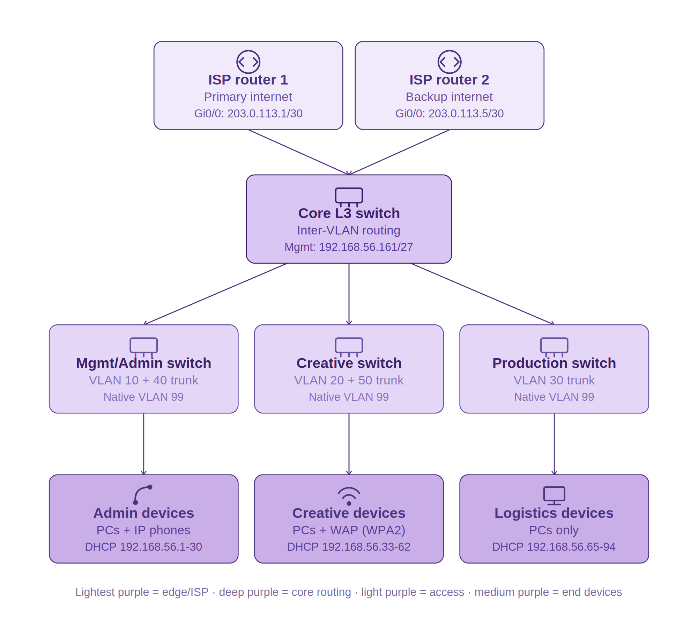
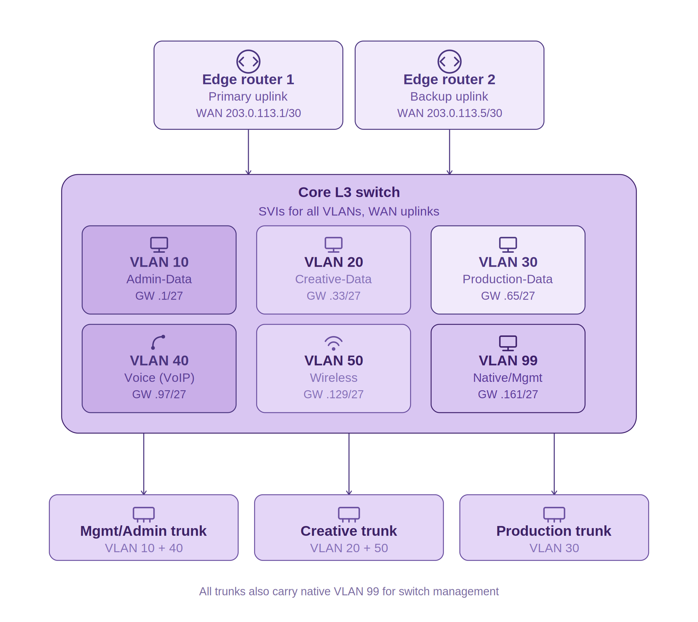

# CMPG325 — Individual Network Project Portfolio

**Student:** Shivuri, Nyeleti · **Student number:** 42718910
**Project ID:** CMPG325-2026-133 · **Client ID:** CLI-133
**Assigned organisation:** Khumo Advertising Billboards (Vryburg) · **Industry:** Media

---

## Table of contents

- [Project overview](#project-overview)
- [Repository structure](#repository-structure)
- [Project status](#project-status)
- [Design summary](#design-summary)
  - [Topology](#topology)
  - [VLAN design](#vlan-design)
  - [IP addressing](#ip-addressing)
- [Client requirements & assumptions](#client-requirements--assumptions)
- [Academic integrity](#academic-integrity)

---

## Project overview

This repository is the portfolio of evidence for my CMPG325 individual network project. The brief assigns Khumo Advertising Billboards (Vryburg) as the client, with a fixed addressing block, a mandatory design constraint (VoIP/data separation), an assigned wireless security challenge (WPA2-PSK hardening), and a resilience change request (dual ISP). Where the brief does not specify organisational detail, I made and documented reasonable network-engineering assumptions, consistent with my lecturer's guidance for this project.

## Repository structure

| Folder | Contents |
|---|---|
| [`01-client-requirements/`](./01-client-requirements) | Client requirements and documented engineering assumptions |
| [`02-topology/`](./02-topology) | Physical and logical topology diagrams (image + editable draw.io source) |
| [`03-ip-addressing/`](./03-ip-addressing) | VLAN table, IP addressing plan, WAN links, trunk configuration |
| [`04-packet-tracer/`](./04-packet-tracer) | Packet Tracer `.pkt` file and build-progress screenshots |
| [`05-configuration/`](./05-configuration) | Device configuration exports (routers, switches, WAP) |
| [`06-testing/`](./06-testing) | Connectivity testing and verification evidence |
| [`07-troubleshooting/`](./07-troubleshooting) | Troubleshooting log |
| [`08-reflection/`](./08-reflection) | Final project reflection |

## Project status

<strong>Milestone 1 — Client Design Review ✅</strong>

- [x] Client requirements
- [x] Documented engineering assumptions
- [x] Physical topology (diagram + explanation)
- [x] Logical topology (diagram + explanation)
- [x] VLAN design table
- [x] IP addressing plan
- [x] Initial GitHub repository

<strong>Milestone 2 — Client Implementation Review 🟡 In Progress</strong>

- [x] Devices placed, labelled, and cabled per physical topology
- [x] Core L3 switch — VLANs, SVIs, trunking, DHCP pools (all verified)
- [x] All three access switches configured (trunk + access ports)
- [x] Edge routers configured — WAN uplinks to both ISPs
- [x] CR15 dual-ISP resilience — configured, tested (failover **and** restore), fully verified with live traffic
- [x] Inter-VLAN routing verified with live pings across all three departments
- [x] All PCs on DHCP, correct addressing confirmed
- [x] WPA2-PSK configured on AP-Creative (AES encryption) — client connection tested, wrong-password rejection tested
- [x] Working `.pkt` file saved to repository
- [x] Troubleshooting log documented
- [ ] Voice VLAN isolation test (formal evidence)
- [ ] Device configuration exports → `05-configuration/`
- [ ] Testing evidence formally organised → `06-testing/`
- [ ] WPA2-Enterprise optional extension (stretch goal, not started)

<strong>Milestone 3 — Final Evaluation ⬜</strong>

- [ ] Packet Tracer project (`.pkt`)
- [ ] GitHub portfolio of evidence
- [ ] Technical report
- [ ] 15–20 minute individual video demonstration
- [ ] Any additional files as required

## Design summary

### Topology

Three-tier hierarchical design (edge/ISP → core L3 switch → access layer), chosen to satisfy CR15 (dual-ISP resilience) and to keep departmental VLANs cleanly separated at the access layer.

View physical topology diagram

View logical topology diagram

Full diagrams and editable `.drawio` source files: [`02-topology/`](./02-topology)

### VLAN design

| VLAN ID | Name | Department |
|---|---|---|
| 10 | Admin-Data | Management / Admin |
| 20 | Creative-Data | Creative / Design |
| 30 | Production-Data | Production / Logistics |
| 40 | Voice (VoIP) | Management / Admin |
| 50 | Wireless | Creative / Design & meeting rooms |
| 99 | Native / Mgmt | Network infrastructure |

Full VLAN justification: [`03-ip-addressing/ip-addressing-plan.md`](./03-ip-addressing/ip-addressing-plan.md)

### IP addressing

Assigned block `192.168.56.0/24`, subnetted into `/27`s across six VLANs. Full table with gateways and usable ranges: [`03-ip-addressing/ip-addressing-plan.md`](./03-ip-addressing/ip-addressing-plan.md)

## Client requirements & assumptions

Full requirements list and documented engineering assumptions (departments, user counts, wireless/VoIP placement, redundancy design): [`01-client-requirements/client-requirements.md`](./01-client-requirements/client-requirements.md)

## Academic integrity

This project is my own individual work, developed according to the CMPG325-2026-133 project brief. Any AI assistance used in preparing documentation or diagrams complied with the applicable NWU AI Policy; I remain responsible for the correctness, understanding, and academic integrity of everything submitted.
